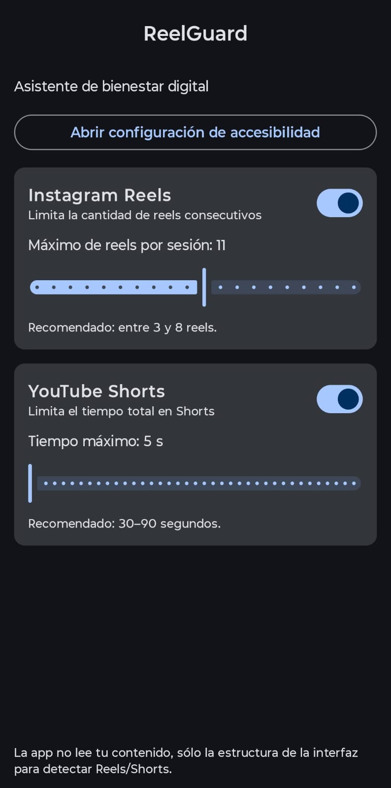

# ReelGuard: Tu Asistente de Bienestar Digital

ReelGuard es una aplicación de Android diseñada para ayudarte a tomar el control de tu consumo de contenido en redes sociales, específicamente en Instagram Reels y YouTube Shorts. Utiliza los Servicios de Accesibilidad de Android para monitorear tu actividad de forma local y segura, sin recolectar ningún tipo de dato personal.

---

## 🌟 Características Principales

- **Límite de Reels en Instagram:** Establece un número máximo de Reels que puedes ver de forma consecutiva. Una vez alcanzado el límite, la app te devuelve a la pantalla de inicio.
- **Control de Tiempo en YouTube Shorts:** Define un tiempo máximo de visualización para los YouTube Shorts. Cuando el tiempo se agota, la app te saca de la sección de Shorts.
- **Configuración Personalizable:** Ajusta los límites según tus propias metas de bienestar digital.
- **Privacidad Primero:** La aplicación funciona completamente en tu dispositivo. No requiere conexión a internet y no recopila ni envía ninguna información personal.
- **Interfaz Moderna:** Desarrollada con Jetpack Compose, siguiendo las últimas guías de diseño de Material You.

---

## 📸 Captura de Pantalla de la aplicación



---

## ⚠️ Una Nota Importante Sobre la Fiabilidad

Esta aplicación funciona analizando la estructura de la interfaz de usuario (UI) de Instagram y YouTube. **No utiliza ninguna API oficial**, ya que no existen para esta finalidad.

Esto significa que su funcionamiento es **frágil por naturaleza**. Si Instagram o YouTube realizan un cambio significativo en el diseño de sus aplicaciones, es muy probable que los servicios de bloqueo de `ReelGuard` dejen de funcionar hasta que se actualicen las heurísticas de detección.

He documentado este enfoque basado en heurísticas en el código de los `AccessibilityService` (`ReelBlockerService` y `YoutubeShortsTimeBlockerService`) como muestra de transparencia técnica.

---

## 🛠️ Tecnologías y Arquitectura

Este proyecto demuestra el uso de tecnologías y prácticas modernas en el desarrollo de Android:

- **Lenguaje:** [Kotlin](https://kotlinlang.org/) (100%)
- **UI:** [Jetpack Compose](https://developer.android.com/jetpack/compose) para una interfaz de usuario declarativa y moderna.
- **Arquitectura:** MVVM (Model-View-ViewModel) para una clara separación de responsabilidades.
- **Gestión de Estado:** [Kotlin Flows](https://kotlinlang.org/docs/flow.html) y [StateFlow](https://developer.android.com/kotlin/flow/stateflow-and-sharedflow) para manejar el estado de la UI de forma reactiva.
- **Persistencia de Datos:** [Jetpack DataStore](https://developer.android.com/topic/libraries/architecture/datastore) (Preferences) para guardar la configuración del usuario de forma asíncrona y segura.
- **Inyección de Dependencias (Manual):** Se sigue un patrón de inyección de dependencias manual para desacoplar las clases.
- **Servicios de Accesibilidad:** Para interactuar con la interfaz de otras aplicaciones de una manera consciente de la privacidad.

---

## 🚀 Cómo Empezar

Para compilar y ejecutar este proyecto, sigue estos pasos:

1.  **Clona el repositorio:**
    ```bash
    git clone https://github.com/TomasSantillanUTN/ReelGuard.git
    ```
2.  **Abre el proyecto** en Android Studio (versión Iguana o superior recomendada).
3.  **Sincroniza Gradle** y espera a que se descarguen todas las dependencias.
4.  **Ejecuta la aplicación** en un emulador o en un dispositivo físico.
5.  **Activa el Servicio de Accesibilidad:** Una vez que la app esté instalada, abre la pantalla de configuración y pulsa en "Abrir configuración de accesibilidad". Desde allí, busca y activa los servicios "ReelGuard" (para Instagram) y "YoutubeShortsTimeBlockerService" (para YouTube).

--- 

*Este proyecto fue creado como parte de mi portfolio personal. ¡Espero que te guste!*